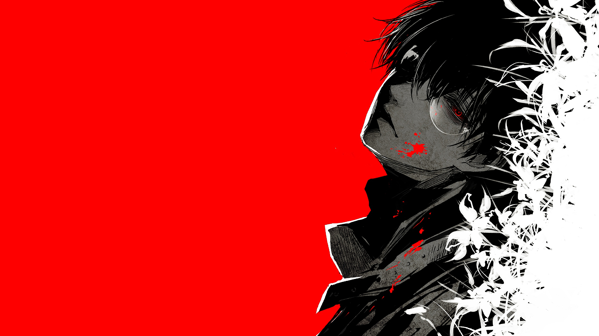

<h1 align="center">Aggelos D.</h1>

  <b>Web Designer & Developer</b>

  

  Building clean, modern and responsive digital experiences.

---

## about

I'm a web designer and developer from Greece focused on creating
modern websites, web applications and clean user interfaces.

I enjoy turning ideas into polished digital experiences and
experimenting with new technologies.

Currently focused on improving my front-end development skills
and building projects for my portfolio.

---

## core skills

  

**languages:** HTML · CSS · JavaScript · TypeScript

**frontend:** React · Responsive Design · UI/UX · Web Animations

**tools:** VS Code · Linux · Git · GitHub

## github stats

  

  

## connect with me

  

  

---

  <i>Design. Develop. Improve.</i>

